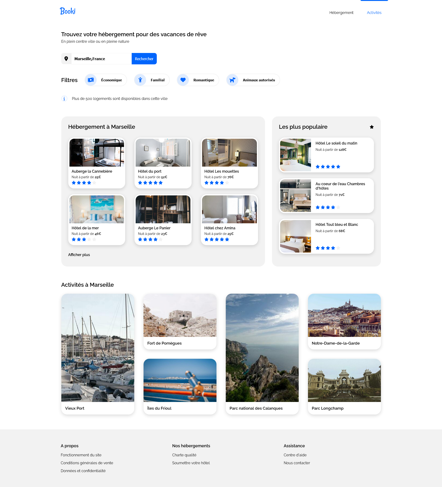
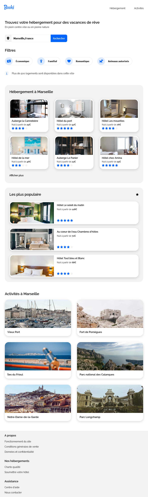
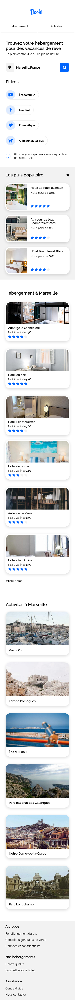

# Formation developpeur web - OPENCLASSROOM

Ma solution au `PROJET 2 - Transformez une maquette en site web avec HTML & CSS` du parcours de formation __developpeur web__ chez Openclassroom.

[Visiter le site](https://vcna-0.github.io/Booki/)

 

## Table des matières

- [Le projet](#le-projet)
  - [Contexte](#contexte)
  - [Éléments fournis pour la réalisation du projet](#éléments-fournis-pour-la-réalisation-du-projet)
  - [Cahier des charges](#cahier-des-charges)
  - [Contraintes](#contraintes)
  - [Palette de couleur](#palette-de-couleur)
  - [Fonts](#fonts)
- [Mon processus](#mon-processus)
  - [Outils et technologies utilisés](#outils-et-technologies-utilisés)
  - [Les difficultés rencontrées](#les-difficultés-rencontrées)
- [Livrables](#livrables)
  - [Screenshots](#screenshot)
  - [Compétences évaluées](#compétences-évaluées)
  - [Notes sur la réalisation](#notes-sur-la-réalisation)
- [Auteur](#auteur)

## 🚀 Le projet

### Contexte

L'objectif est d'intégrer la maquette en responsive d'un site nommé __"Booki"__. 
C'est un site de planification de vacances one-page. 

### Éléments fournis pour la réalisation du projet

* Une maquette pour la version desktop
* Une maquette pour la version mobile
* Une note de synthèse
* Les images
* Le logo

### Cahier des charges

* Spécifications fonctionnelles
  * :white_check_mark: Le champ de recherche est un champ de saisie, le texte doit donc pouvoir être édité par l’utilisateur. La partie recherche ne doit pas être fonctionnelle
  * :white_check_mark: Chaque carte d’hébergement ou d’activité devra être cliquable dans son intégralité. Pour l’instant les liens seront vides.
  * :white_check_mark: Les filtres doivent changer d’apparence au survol. Ils ne doivent pas être fonctionnels
  * :white_check_mark: Les textes “Hébergements” et “Activités”, situés dans l’en-tête, sont des ancres. Ils doivent mener respectivement vers la section “Hébergements à Marseille” et “Activités à Marseille”.
  * :white_check_mark: Les images doivent être choisies au format le plus adapté par rapport à la résolution et au temps de chargement

* Spécifications techniques
  * :white_check_mark: Le site doit être adapté au format desktop et mobile conformément aux maquettes fournies. Même si aucune maquette pour la version tablette n'est fournis, le site doit être adapté au format tablette.
  * :white_check_mark: Le code doit être valide aux validateurs W3C (HTML et CSS)
  * :white_check_mark: Le site doit être compatible avec les dernières versions de Google Chrome et Mozilla Firefox

### Contraintes

* Le site doit être intégré en desktop first
* Utilisation de flexbox fortement recommandé plutôt que grid
* Les frameworks ou préprocesseurs CSS ne doivent pas être utilisés

### Palette de couleur

`#0065FC` → Bleu  
`#DEEBFF` → Bleu clair  
`F2F2F2`  → Gris  

### Fonts

La police du site est `Raleway`

## 🔨 Mon processus

### Outils et technologies utilisés

* VScode
* Firefox developer
* Flexbox pour la majorité du site
* Grid pour la partie activité
* Importation des icones avec fontAwesome

### Les difficultés rencontrées

Petite difficulté rencontré au niveau de la partie « activité » qui a été plus simple pour moi d'intégrer avec grid plutôt qu'avec les flexbox.

## 📚 Livrables

### Screenshots

  
Desktop

  

    
  

  
Tablette

  

    
  

  
Mobile

  

    
  

### Notes sur la réalisation

## Auteur

- Github - [Noëmie](https://github.com/Vcna-0)
- Twitter - [@Noëmie](https://twitter.com/Odymonie)

